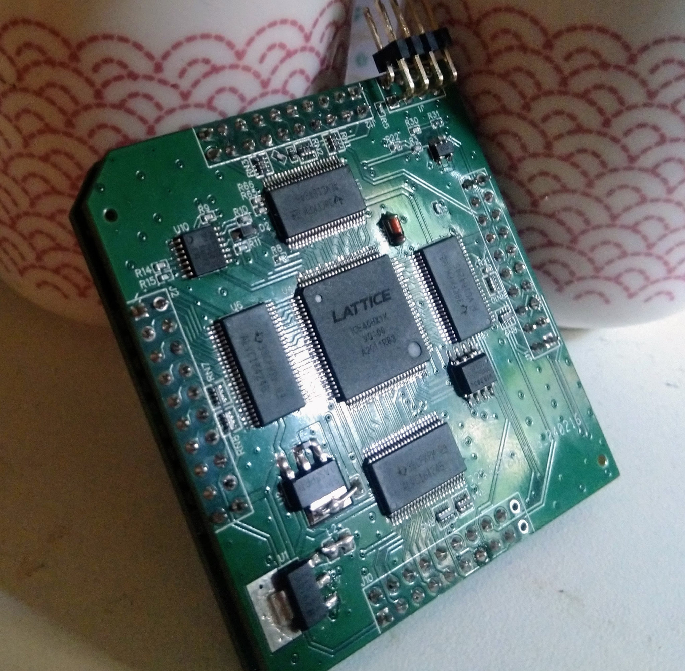
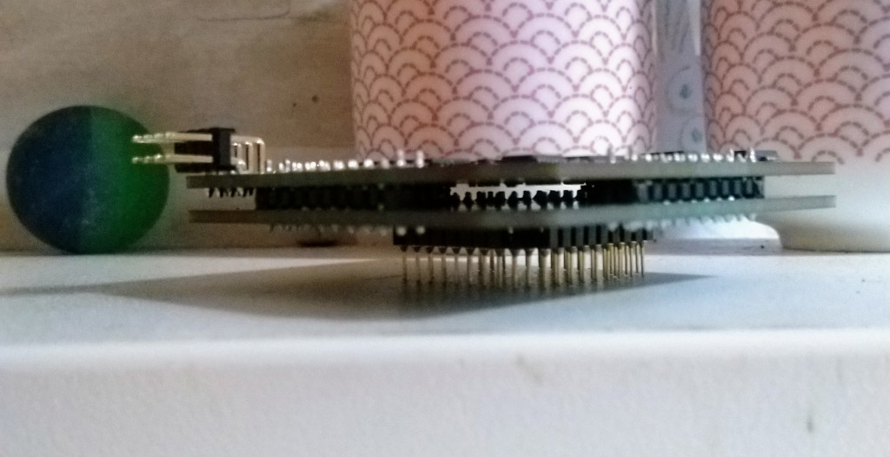
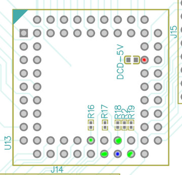
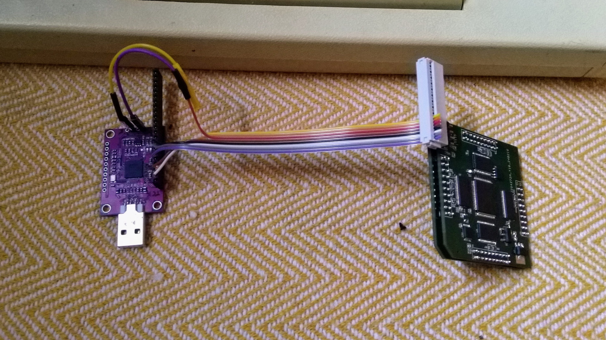
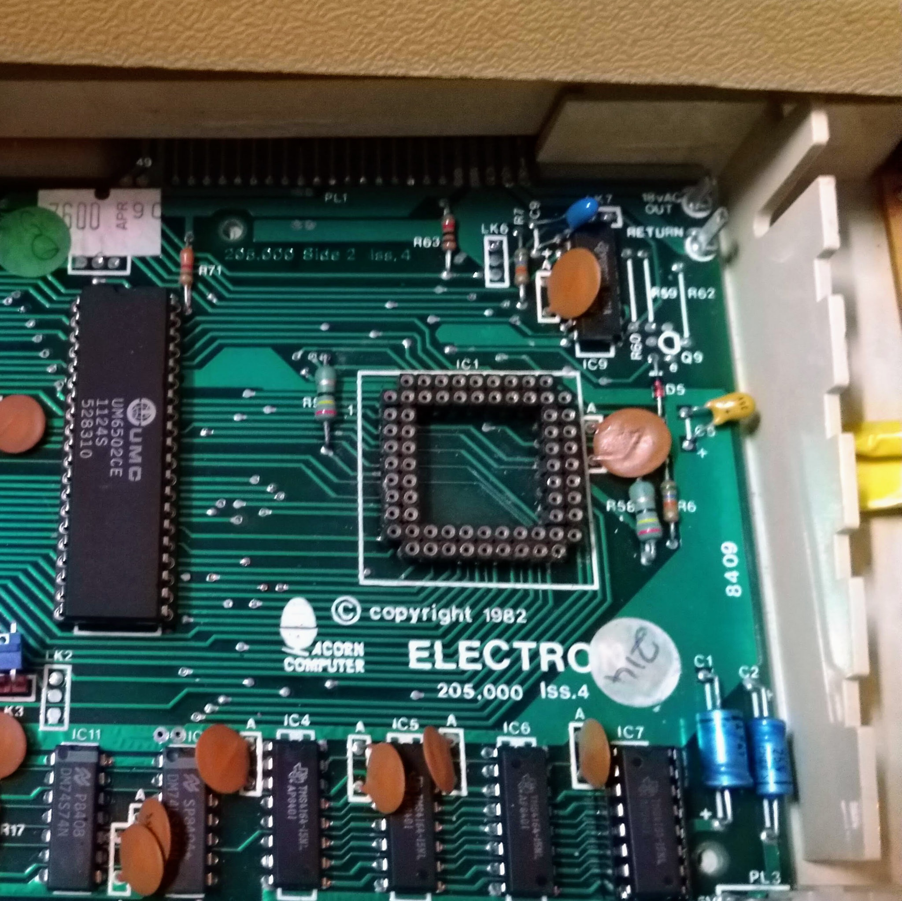
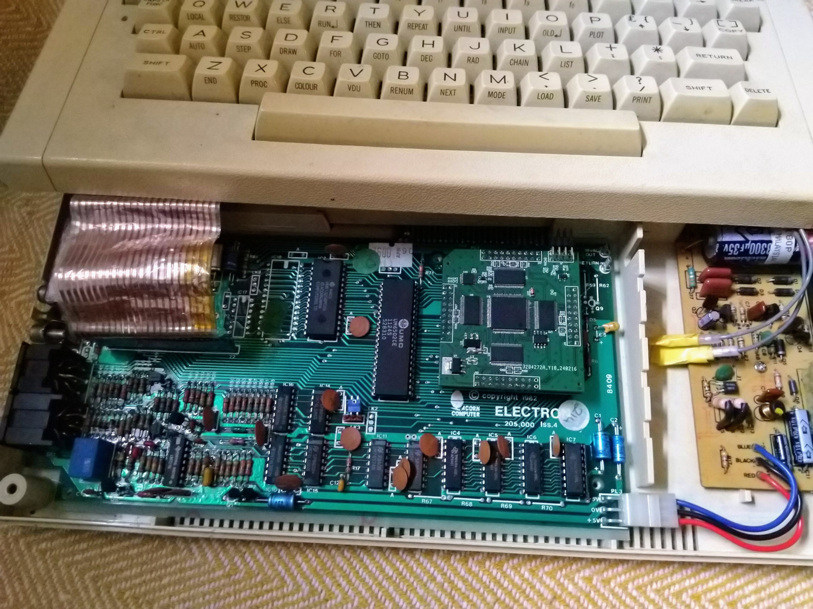

# JamSoftElectronULA

A project to replace the original Acorn Electron ULA with a ice40 based FPGA board, by Chris Jamieson.



This is a no-frills* ULA replacement meaning that it just replicates the stock Acorn Electron ULA without adding new features. It requires the standard Electron DRAM, ROM and CPU and other components to be present and working as a normal ULA would.

Features:

- Keyboard controls: CAPS LED, Break, Ctrl+Break & Shift Break as you'd expect
- Tape interface: loading, saving and remote motor control works great using standard cables
- RGB output (I use a RGBtoHDMI connected to it and it works great)
- Composite Out (Mono and colour with jumper)
- RF Out seems fine too
- DRAM Controller - uses the normal 4164 DRAM chips
- All the usual Electron-y things!

Examples of various games known to work:

- Firetrack
- Sphere of Desiny
- Chuckie Egg
- Exile
- Citadel
- Joe Blade
- Imogen
- ElectroBots
- 0xC0DE's Bouncing Basketball & Vertical Rupture demos
- Snapper
- Elite
- Zalaga
- Cylon Attack
- Galaforce & Galaforce 2
- Southern Belle
- ...and many more...

Peripherals Tested and working:

- ElkSD
- First Byte Joystick Interface Clone (my [Least Bit Joystick Interface](https://github.com/moogway82/TheLeastBitJoystickInterface))

Missing features:

- NMI signal is ignored at present, so the Elk will likely crash with any peripheral that tries to use it (this functionality could be added to VHDL code if required, the signal is connected to the FPGA)

## Development, Testing and Current State

The bulk of development and testing has been done on 2 Electrons with the following specifications:

- A repaired Issue 6 board with a Rockwell R6502 and 4x Samsung KM4164B-15 DRAM chips. Tested with and without IC18 to buffer/unbuffer the 16MHz clock, PHI0 and NMI signals.
- An Issue 4 board with a UMC UM6502 and 4x TI TMS4164-15 DRAM chips.
- A repaired Issue 6 Electon PSU Board, powered from a non-original 12V AC Adapter

The JamSoftElectronULA is being provided as-is, with no guarantees. I've had a lot of issues come and go with reliability during the course of development and testing but I think it's in a good-enough state now to get out there and not be just sitting on my workbench.

I think a lot of the reliability issues I've had boil down to:

- Questionable state of my Electron boards. My issue 6 came without ULA (can you guess the reason for this project? :) ) and needed a lot of repair work and the Issue 4 was also from salvage.
- Bad ULA socket - I think I damaged some of the pin sockets on the boards with an original ULA that still had some solder left on it's pins. Re-seating the JamSoftElectronULA, testing and bending pins has been required to make more reliable connections.
- Iffy PSU. The power supply I'm using has had repairs and is running off a 12V AC adapter instead of the 19V AC of the original Elk. I also think my FPGA board may be more sensitive to power issues that the original Acorn ULA.

I've also sunk about as much time and money into this project as I wish to at present, so I'm drawing a line and publishing where I'm at. Hopefully it can help to resurrect some dead Electrons and if it needs some more development I'm hoping that perhaps others can continue this and create their own versions with fixes and improvements. Good luck!

[Some of the development history on Stardot Forums](https://stardot.org.uk/forums/viewtopic.php?t=26929)

## * Well, 1 Frill, actually...

The 1 'frill' with the current version is a simple Turbo mode which can be enabled using the key combo Ctrl + Caps + 2. The turbo mode uses the 8KB of embeded Block RAM on the FPGA as fast, 2MHz CPU clock & un-contended RAM which replaces the lower 8K of memory from the slower DRAM and provides a decent speed boost, especially in Modes 0-4 where the CPU is usually halted when trying to access RAM duing an active scanline. Normal speed is resumed as soon as a Break is issued. This almost gets the Elk up to BBC B speeds on the ClockSp benchmark. Many thanks to the [Ramtop-Retro's OSTC project](https://github.com/ramtop-retro/ostc) for providing the inspiration here.

Ideas for future 'Frills' could be:

- Add MMFS and connect an SD-Card to the FPGA programming pins
- Connect a NES joypad to the Programming pins
- Mode 7 support
- Multiple ROM support 
- ...whatever you can think of, the code's all here, knock yourself out!

# Building your own

The current design is made of 2 PCBs: a main 'TOP' board with the FPGA and most components and a 'BOTTOM' socket adapter board with a few pull-ups on it. The two boards are sandwiched together using short header pins. I made it this way to keep the overall footprint as small as possible and make it look a bit more ULA-chip-like than a big daughter board would have. Although, I do admit that a larger board would've been easier to make and assemble... feel free to make your own version :)



## Gerber, BOM & Pick and Place Files

The BOM has order numbers for either LCSC or JLCPCB to keep the costs to a minimum, especially for the passives and connectors. However the FPGA is not readily available from these sources, so you might need to get that from elsewhere. It does make it quite easy to have the boards created and populated by JLCPCB which is convenient.

Fabrication Files:

### TOP PCB:

- [Gerbers](Hardware/TOP%20Board/Gerber_PCB_JamSoftElectronULA_TOP.zip)
- [BOM](Hardware/TOP%20Board/BOM_JamSoftElectronULA_TOP.csv)
- [Pick & Place](Hardware/TOP%20Board/PickAndPlace_PCB_JamSoftElectronULA_TOP.csv)

### BOTTOM PCB:

- [Gerbers](Hardware/BOTTOM%20Board/Gerber_PCB_JamSoftElectronULA_BOT.zip)
- [BOM](Hardware/BOTTOM%20Board/BOM_JamSoftElectronULA_BOT.csv)
- [Pick & Place](Hardware/BOTTOM%20Board/PickAndPlace_PCB_JamSoftElectronULA_BOT.csv)

## Assembly tips

Helpful Files:

- [Full Schematics](Hardware/Schematic_JamSoftElectronULA.pdf)
- Interactive BOM Maps: [TOP](Hardware/TOP%20Board/ibom.html), [BOTTOM](Hardware/BOTTOM%20Board/ibom.html)
- [TOP PCB upperside image](Hardware/TOP%20Board/PCB_JamSoftElectronULA_TOP_above.pdf)
- [TOP PCB underside image](Hardware/TOP%20Board/PCB_JamSoftElectronULA_TOP_under.pdf)
- [BOTTOM PCB upperside image](Hardware/BOTTOM%20Board/PCB_JamSoftElectronULA_BOT_above.pdf)
- [BOTTOM PCB underside image](Hardware/BOTTOM%20Board/PCB_JamSoftElectronULA_BOT_under.pdf)


I'd recommend having JCLPCB assemble all the passives on the top board as these are very fiddly and time-consuming to do by hand.

Take your time soldering the FPGA and Level Shifters - use plenty of good flux. I test all adjacent pins for shorts, it can be very hard to spot some bridges. And, I prod each pin under the microscope to see if any move and need to be reflowed. I spent a couple of months troubleshooting my first prototype board only to find that the problems were caused by some very bad soldering and loads of poorly connected pins!

### Things to check before you 'sandwich' boards

As it would be a massive pain to desolder the header pins that hold the two boards together, here's a few things to test for before you commit.

#### Upper-side of the BOTTOM board:

- All the resisters are pull-ups here, so using multimeter in resistance mode, put one probe on 5V 'pad, coloured red below, and the other one:

  - Green pads for R16, R17, R18, R19: should each be about 4.7kΩ
  - Blue pad for R2: should be about 10kΩ



- If they are reading inifinity ("OL") then try reflowing as one side is not connected (probably the 5V side as it's harder to heat). If it's showing ~0 then it's a short, check for solder bridges on the resistor.
- In continuity mode, put probes on either side of DCD-5V. You may get a short beep as the capacitor charges, but it should not be continuous, if it's continuous then there is a short, best double check for bridges.

#### Under-side of TOP board:

- There are a lot of passives to check here so I usually just start by checking some of the 1V2, 3V3 and 5V bypass caps to test those rails for shorts. Like the 5V on the BOTTOM board, put multimeter in continuity and you should get a short beep touching both sides of a bypass cap. If you get a continuous beep, you need to look for solder bridges on any of the components on that power rail.
- If I've soldered them all myself (not recommended!) then I will test all of the passive components by:

  - Are properly attached to their pads by using continuity mode and touching one side of the passive and following a trace to something it's supposed to be connected to, then checking the other side in the same way
  - Still in continuity, touching each side of the component and checking that it's not shorted - caps may beep when charging but as before, should not be continuous.

- If JLCPCB/PCBWay have done the assembly here, I usually just give it a good visual inspection after testing the power rails.

Be careful when joining the two boards to ensure that components on the facing surfaces don't make contact and create bridges. I think a 2.5mm-3mm gap, the standard insulation hight on header pins, is enough clearance, but do double check by holding it up to the light. Also, the tops of socket pins on the BOTTOM board may have solder peaks on them that might need smoothing off.

# Building Firmware and Programming

## Building

### On Linux:

Download the FPGA toolchain as provided in the releases by [YoSysHQ OSS-CAD-Suite-build project](https://github.com/YosysHQ/oss-cad-suite-build) unzip it to the directory of your choice (I use '~/opt/oss-cad-suite').

Edit the path in the Make file to where the 'oss-cad-suite' bin folder is:

```
OSSCADBINPATH=~/opt/oss-cad-suite/bin
```
Other common \*NIX tools used by the Makefile are: head, printf, dd, cp & tail

The just run the Makefile.

```
make
```

## Programming the FPGA

### On Linux:

There is a pre-build binary configuration file in the 'Software' folder [JamSoftElectronULA_config_medium.bin](Software/JamSoftElectronULA_config_medium.bin), but the iceprog tool (from [YoSysHQ OSS-CAD-Suite-build project](https://github.com/YosysHQ/oss-cad-suite-build)) will still be required to program it to the configuation ROM using the Makefile.

Programming the firmware can be done using a [cheap FT232H board](https://www.aliexpress.com/item/32817060303.html) or FT2232H boards. A Raspberry Pi can also be used, see below. With the JamSoftElectronULA board out of the Electron socket, connect the programming pins as shown:

| JamSoftElectronULA J1 pin | FT232H pin     | 
| ------------------------- | -------------- |
| 1 CS                      | AD4            | 
| 2 CDONE                   | AD6            |
| 3 SPICLK                  | AD0            |
| 4 CRESET                  | AD7            |
| 5 CIPO                    | AD2            |
| 6 +3.3V                   | +3.3V          |
| 7 COPI                    | AD1            |
| 8 GND                     | GND            |





And then run:

```
make prog
```

Take a look at the 'prog:' section in the [Makefile](Software/Makefile) to see the iceprog command being run to program it if you don't want to use make.

It should upload and verify and you're good to pop it in the Electron.

There are a few Test Bench (TB) VHDL files in the project, they're a bit messy and just testing whatever I needed at the time to debug. I've left them in the project as there is hopefully some useful stuff in there.

Tests can be run using:
```
make test
```
And the resulting .vcd file can be analysed using gtkwave, also provided in the OSS CAD Suite Build project.

### On a Raspberry Pi:

If you don't have the FT232H or FT2232H boards, you can use a Raspberry Pi.

With Raspbian OS installed, this repo in a folder and the board connected to the internet, enable the SPI port on the Pi by running:
```
sudo raspi-config 
```
And select "P4 SPI" under the "Interfacing" options.

Install Flashrom tool:
```
sudo apt install git libpci-dev libusb-1.0-0 libusb-dev
git clone https://github.com/flashrom/flashrom.git
cd flashrom
make
sudo make install
```

Then connect the board with the following cabling:

| Raspberry Pi 1 | JamSoftElectronULA |
| -------------- | ------------------ |
| 1 3v3          | 6 3v3              |
| 6 GND          | 8 GND              |
| 11 GPIO 17     | 4 CRESET           |
| 19 MOSI        | 7 COPI             |
| 21 MISO        | 5 CIPO             |
| 23 SCLK        | 3 SPICLK           |
| 24 SPI0 CE0    | 1 CS               |

And then run:
```
make progpi
```

See the 'progpi:' section of the [Makefile](Software/Makefile) for the commands that are run to do the programming if you want to do that with just the bitstream file manually.

### On Mac OS X:

I used to use Mac OS X for development so the Linux instructions should work there too, but I've not tested things on that platform for a while now...

### On Windows:

Sorry I can't help for Windows as I'm unsure of the state of any of these tools in that environment, sorry...

# Installing into the Electron

Replace the 68-pin socket with either a good quality 68-pin 11x11 PGA Socket or just some nice [round-pin SIL female headers](https://hobbycomponents.com/connectors/392-01-254mm-40way-sil-turned-pin-m-f-headers-pack-of-5) and cut them up to fit.



Take care to align the pins and orient the board with the cut-corner to the dot shown on the Elk mainboard silkscreen and press down firmly to make a good connection. There isn't much cleance between it and the keyboard but it should fit in.



Switch on and hope it goes 'beep' :)

# Troubleshooting

Ah, so it didn't go 'beep', sorry :(

Here are some things you can check for:

- Sometimes the Elk doesn't come up correctly on power-up first time, try using Ctrl + Break or it off and on again
- You did plug in the Speaker and Video cables and check the monitor/TV was tuned and working, right? :)
- Check voltages on the board using a multimeter - are you seeing a nice 5V, 3.3V and 1.2V on the board when powered up? Voltages can be easily checked on the pins of the Voltage Regulators - see the [Schematics](Hardware/Schematic_JamSoftElectronULA.pdf) to help identify pins.
- Taking it out and re-programming it - check that it says it verified after writing. If not, check the programmer is wired correctly.
- Check the pins are making a good connection in the socket - I check the top of each interrconnecting header pin with the leg of the component on the mainboard is showing continuity. Use the Schematic here and the Electron Schematics to see what pin of the interrconnects go where.
- Double check for solder bridges and poorly connected pins on the FPGA and Level Shiter ICs. Prod them under a microscope and look for movement and test continuity with adjacent pins (nice sharp multimeter probes are really helpful for this).
- If you have a scope you can check that the FPGA is reading the SPI ROM on start-up (probe the CIPO pin 5 on the config header pin, is it showing a burst of activity on power up). If not the FPGA may be stuck in PoR (missing one of it's voltages) or the SPI ROM chip is not connected properly.
- Usual troubleshooting now applies... Time to get the scope out and check: Elks PoR signal, 16MHz Oscillator, CPU Reset, Phi0, ROM enable, Address lines, Data lines, DRAM CAS/RAS, DRAM Address lines, DRAM Data lines, etc... See anything weird? Check the FPGA board soldering or socket connections to those signals using the schematic. Maybe the Elk Motherboard needs some work too (ie, needs a good Power on Reset signal and 16MHz clock), maybe you have a you have a bad 16MHz Crystal, 6502, DRAM, ROM, etc..? I have a basic diag ROM called the [ElkWSS-DiagROM](https://github.com/moogway82/ElkWSS-DiagROM) which might help see if PoR, CPU and DRAM is working ok...
- Get in touch via the [Stardot forums](https://stardot.org.uk/forums/index.php), I might be able to help or others might have some ideas what's going wrong...

# Acknowledgements

Big thanks to the following people for their support, inspiration and feedback:

- ScurvyGeek on Twitter who alerted me to the Electron joblot I got my poorly machine from, and for telling me that a missing ULA was not the end for it...
- David Banks (aka hoglet) for his ElectronFpga VHDL which is the codebase I started from
- Myelin's UltimateElectronULA board which was a useful reference to some of the hardware interfacing issues
- Gary Preston (aka Hicks) who's [Blog](https://www.mups.co.uk/project/hardware/acorn_electron/) and code was super helpful to understanding the Electron better
- Budgie for showing me that a simplier FPGA ULA project was possible and something I might manage
- Eric Schlaepfer (aka TubeTime) for the Graphics Gremlin project which gave me an inexpensive, Open-Source, 5V tollerant FPGA project to form the base of my hardware design
- Dave Hitchins for being really supportive to me from early on and sharing his knowledge and Electron hardware for me to test against
- Gary Colville (aka ramtop) for his support and providing access to his amazing ElkSD which sped up testing considerably
- Julian, a volunteer at the RMC Retro Cave who was really supportive and gave me a much needed boost to carry on when it wasn't going well
- The Stardot community - great group of people and just an amazing place for all things Acorn
- MFMI Lee and his Discord Server for just being a super supportive community and giving me the push to get this out there
- Libi, my amazing partner for putting up with me mucking about on old computers


# Licence

The VHDL source code, all files under 'Software' folder and sub-folders, is derived from [Dave Banks, hoglet ElectronFpga project](https://github.com/hoglet67/ElectronFpga) licenced under GPL v3. 

Board design, all files under 'Hardware' folder and sub-folders, is derived from [Tube Time, schlae Graphics Gremlin project](https://github.com/schlae/graphics-gremlin) and licenced under a [Creative Commons Attribution-ShareAlike 4.0 International License](https://creativecommons.org/licenses/by-sa/4.0/). 
